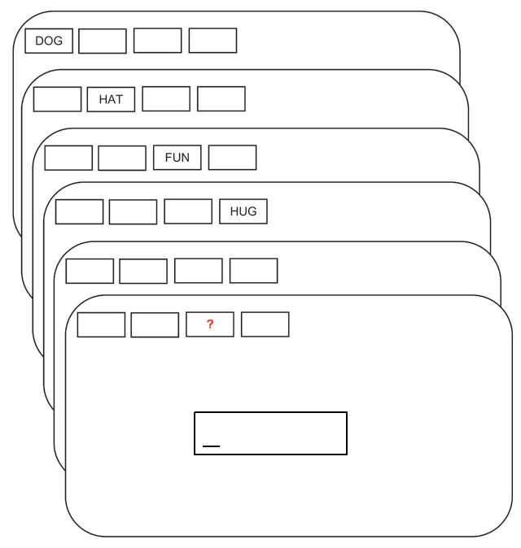

# Bayesian regression models {#ch-reg}

We generally run experiments because we are interested in the relationship between two or more variables. A regression will tell us  how our \index{Dependent variable} *dependent variable*, also called the *response* or \index{Outcome variable} *outcome variable* (e.g., pupil size, response times, accuracy, etc.) is affected by one or many \index{Independent variable} *independent variables*, *predictors*, or \index{Explanatory variable} *explanatory variables*. Predictors can be categorical (e.g., male or female), ordinal (first, second, third, etc.), or continuous (e.g., age). In this chapter we focus on simple regression models with different likelihood functions. 

```{r echo = FALSE}
## no idea why dplyr doesn't remember this
select <- dplyr::select
```

## A first \index{Linear regression} linear regression: Does attentional load affect pupil size? {#sec-pupil}

Let us look at the effect of cognitive processing on human pupil size to illustrate the use of Bayesian linear \index{Regression model} regression models. Although pupil size is mostly related to the amount of light that reaches the retina or the distance to a perceived object, \index{Pupil size} pupil sizes are also systematically influenced by cognitive processing:  Increased cognitive load leads to an increase in the pupil size [for a review, see @mathotPupillometryPsychologyPhysiology2018].

For this example, we'll use the data from one subject's pupil size of the control experiment by @wahnPupilSizesScale2016,  averaged by trial. The data are available from `df_pupil` in the package `bcogsci`.
In this experiment, the subject covertly tracks between zero and five objects among several randomly moving objects on a computer screen. This task is called  \index{Multiple object tracking} multiple object tracking [or MOT; see @pylyshynTrackingMultipleIndependent1988]. First, several objects appear on the screen, and a subset of the objects are indicated as "targets" at the beginning. Then, the objects start moving randomly across the screen and become indistinguishable. After several seconds, the objects stop moving and the subject need to indicate which objects were the targets. See Figure \@ref(fig:mot). Our research goal is to examine how the number of moving objects being tracked--that is, how attentional load--affects pupil size.

(ref:mot) Flow of events in a trial where two objects need to be tracked. Adapted from @Blumberg2015; licensed under CC BY 4.0 (https://creativecommons.org/licenses/by/4.0/).

```{r mot, fig.cap = "(ref:mot)", out.width = "80%", echo = FALSE, fig.align = "center"}
knitr::include_graphics("cc_figure/MOT.png", dpi = 1000)
```


### \index{Likelihood} Likelihood and \index{Prior} priors

We will model pupil size as normally distributed, because we are not expecting a skew, and we have no further information available about the distribution of pupil sizes. (Given the units used here, pupil sizes cannot be of size zero or negative, so we know for sure that this choice is not exactly right.) For simplicity, assume a linear relationship between load and the pupil size. 

Let's summarize our assumptions:

1.  There is some average pupil size represented by $\alpha$.
2.  The increase of attentional load  has a linear relationship with pupil size, determined by $\beta$.
3.  There is some noise in this process, that is, variability around the true pupil size. This variability is represented by the scale $\sigma$.
4.  The noise is normally distributed.

The generative probability density function will be as follows:

\begin{equation}
p\_size_n \sim \mathit{Normal}(\alpha + c\_load_n \cdot \beta,\sigma)
\end{equation}

where $n$ indicates the observation number with $n = 1, \ldots, N$.

This means that the formula in `brms` will be  `p_size ~ 1 + c_load`, where `1` represents the intercept, $\alpha$, which doesn't depend on the predictor, and `c_load` is the predictor that is multiplied by $\beta$.  The prefix `c_` will generally indicate that a predictor (in this case load) is centered (i.e., the mean of all the values is subtracted from each value). If load is centered,  the intercept represents the pupil size at the average load in the experiment (because at the average load, the centered load is zero, yielding $\alpha + 0 \cdot \beta$). If the load had not been centered (i.e., starts with no load, then one, two, etc.), then the intercept would represent the pupil size when there is no load. Although we can fit a frequentist model with `lm(p_size ~ 1 + c_load, data set)`, when we fit a Bayesian model, we have to specify  priors for each of the parameters.

For setting plausible priors, some research needs to be done to find some  information about pupil sizes. Although we might know that pupil diameters range between  2 to 4 mm  in bright light to 4 to 8 mm in the dark [@spectorPupils1990], this experiment was conducted with the Eyelink-II eyetracker which measures the pupils in arbitrary units [@hayesMappingCorrectingInfluence2016]. If this is our first-ever analysis of pupil size, before setting up the priors, we'll need to look at some measures of pupil size. (If we had analyzed this type of data before, we could also look at estimates from previous experiments). Fortunately, we have some measurements of the same subject with no attentional load for the first 100 ms, measured every 10 ms,  in the data frame `df_pupil_pilot` from the package `bcogsci`: This will give us some idea about the order of magnitude of our dependent variable.

```{r, message = FALSE}
data("df_pupil_pilot")
df_pupil_pilot$p_size %>% summary()
```

With this information we can set a \index{Regularizing prior} regularizing prior for $\alpha$. Center the prior around 1000 to be in the right order of magnitude.^[The average pupil size will probably be higher than 800, since this measurement was with no load, but, in any case, the exact number won't matter, any mean for the prior between 500-1500 would be fine if the standard deviation is large.] Since we don't know how much pupil sizes are going to vary by load yet, we include a rather wide prior by defining it as a normal distribution and setting its standard deviation as $500$.

\begin{equation}
\alpha \sim \mathit{Normal}(1000, 500) 
\end{equation}


Given that our  predictor load is centered, with the prior for $\alpha$, we are saying that we suspect that the average pupil size  for the average load in the experiment will be in a 95% credible interval limited by approximately $1000 \pm 2 \cdot 500 = [0, 2000]$ units. We can calculate this with more precision in `R`  using the `qnorm()` function:

```{r}
qnorm(c(.025, .975), mean = 1000, sd = 500)
```

We know that the measurements of the pilot data are strongly correlated because they were taken 10 milliseconds apart. For this reason, they won't give us a realistic estimate of how much the pupil size can vary. Accordingly, set up quite an uninformative prior for $\sigma$ that encodes this lack of precise information: $\sigma$  is surely larger than zero and has to be in the order of magnitude of the pupil size with no load.

\begin{equation}
\sigma \sim \mathit{Normal}_+(0, 1000)
\end{equation}

With this prior for $\sigma$, we are saying that we expect that the standard deviation of the pupil sizes should be in the following 95% credible interval.


```{r}
qtnorm(c(.025, .975), mean = 0, sd = 1000, a = 0)
```

In order to compute the 95% credible interval, we used \index{\texttt{qtnorm()}} `qtnorm()` from the \index{\texttt{extraDistr}} `extraDistr` package rather than `qnorm()`. As mentioned earlier, the relevant command specification is `qtnorm(n, mean, sd, a = 0)`; recall that `a = 0` indicates a \index{Truncated normal distribution} truncated normal distribution, truncated at the left by zero.


The mean of $\mathit{Normal}_+$, a normal distribution truncated at zero so as to allow for only positive values, does not coincide with its location indicated with the parameter $\mu$ (and neither does the standard deviation coincide with the scale, $\sigma$); see Box \@ref(thm:truncation).

```{r}
samples <- rtnorm(20000, mean = 0, sd = 1000, a = 0)
c(mean = mean(samples), sd = sd(samples))
```

We still need to set a prior for $\beta$, the change in pupil size produced by the attentional load. Given that pupil size changes are not easily perceptible (we don't usually observe changes in pupil size in our day-to-day life), we expect them to be much smaller than the pupil size (which we assume has mean 1000 units),  so we use the following prior:

\begin{equation}
\beta \sim \mathit{Normal}(0, 100)
\end{equation}


With the prior of $\beta$, we are saying that we don't really know if the attentional load will increase or even decrease the pupil size (it is centered at zero), but we do know that one unit of load (that is one more object to track) will potentially change the pupil size in a way that is consistent with the following 95% credible interval.

```{r}
qnorm(c(.025, .975), mean = 0, sd = 100)
```
That is, we don't expect changes in size that increase or decrease the pupil size more than 200 units for one unit increase in load.


The priors we have specified here are relatively \index{Uninformative prior} uninformative; as mentioned earlier, this is because we are considering the situation where we don't have much prior experience with pupil size studies. In other settings, we might have more prior knowledge and experience; in that case, one could use somewhat more principled priors. We will return to this point in the chapter on priors  (chapter \@ref(ch-priors)) and on the Bayesian workflow (chapter \@ref(ch-workflow)).


### The \index{brms} `brms` model 

Before fitting the `brms` model of the effect of load on pupil size, load the data and center the predictor `load`:
  
```{r, message = FALSE}
data("df_pupil")
(df_pupil <- df_pupil %>%
   mutate(c_load = load - mean(load)))
```

Now fit the `brms` model:

```{r fitpupil, message = FALSE, results = "hide"}
fit_pupil <-
  brm(p_size ~ 1 + c_load,
      data = df_pupil,
      family = gaussian(),
      prior = c(prior(normal(1000, 500), class = Intercept),
                prior(normal(0, 1000), class = sigma),
                prior(normal(0, 100), class = b, coef = c_load)))
```

The only difference from our previous models is that we now have a predictor in the formula and in the priors. \index{Prior} Priors for predictors are indicated with `class = b`, and the specific predictor with `coef = c_load`. If we want to set the same priors to different predictors we can omit the argument `coef`. Even if we drop the `1` from the formula, `brm()` will fit the same model as when we specify `1` explicitly. If we really want to remove the intercept, this must be indicated with `0 +...` or `-1 +...`. Also see the Box \@ref(thm:intercept) for more details about the treatment of the intercepts by `brms`. The priors are normal distributions for the intercept ($\alpha$) and the slope ($\beta$), and a truncated normal distribution for the scale parameter $\sigma$, which coincides with the standard deviation (because the likelihood is a normal distribution). `brms` will automatically truncate the prior specification for $\sigma$ and allow only positive values.

Next, inspect the output of the model. The \index{Posterior} posteriors and \index{Traceplots} traceplots are shown in Figure \@ref(fig:posteriorsloadpupilsize); this figure is generated by typing:

(ref:posteriorsloadpupilsize) The posterior distributions of the parameters in the `brms` model `fit_pupil`, along with the corresponding traceplots.

```{r posteriorsloadpupilsize,fig.cap="(ref:posteriorsloadpupilsize)"}
plot(fit_pupil)
```


```{r, eval = FALSE}
fit_pupil
```
```{r, echo = FALSE}
short_summary(fit_pupil)
```

In the next section, we discuss how one can communicate the relevant information from the model.


###  How to communicate the results?

```{r, echo = FALSE}
mean_load <- posterior_summary(fit_pupil, variable = "b_c_load")[, "Estimate"] %>%
  round(2)
load_l <- posterior_summary(fit_pupil, variable = "b_c_load")[, "Q2.5"] %>%
  round(2)
load_h <- posterior_summary(fit_pupil, variable = "b_c_load")[, "Q97.5"] %>%
  round(2)
```


We want to answer the research question "What is the effect of attentional load on the subject’s pupil size?" To answer this question, we'll need to examine what happens with the posterior distribution of $\beta$, which is printed out as `c_load` in the summary of `brms`. The summary of the \index{Posterior} posterior tells us  that the most likely values of $\beta$ will be around the mean of the posterior, `r mean_load`, and we can be 95% certain that the  value of $\beta$, given the model and the data, lies between `r load_l` and `r load_h`.

The model tells us that as attentional load increases, the pupil size of the subject becomes larger. If we want to determine how likely it is that the pupil size increased rather than decreased, we can examine the proportion of samples above zero. (The intercept and the slopes are always preceded by `b_` in `brms`.  One can see all the names of parameters being estimated with `variables()`.)

```{r}
mean(as_draws_df(fit_pupil)$b_c_load > 0)
```

**This high probability does not mean that the effect of load is non-zero.** It means instead that it's much more likely that the effect is positive rather than negative.  In order to claim that the effect is likely to be non-zero, we would have to compare the model with an alternative model in which the model assumes that the effect of load is $0$. We'll come back to this issue when we discuss model comparison in chapter \@ref(ch-comparison).

### Descriptive adequacy {#sec-pupiladq}

Our model converged and we obtained a posterior distribution. However, there is no guarantee that our model is good enough to represent our data. We can use posterior predictive checks to check the \index{Descriptive adequacy} descriptive adequacy of the model. 


Sometimes it's useful to customize the \index{Posterior predictive check} posterior predictive check to visualize the fit of our model. We iterate over the different loads (e.g, 0 to 4), and we show the posterior predictive distributions based on 100 simulations for each load together with the observed pupil sizes in Figure \@ref(fig:postpreddens). We don't have enough data to derive a strong conclusion: both the predictive distributions and our data look very widely spread out, and it's hard to tell if the distribution of the observations could have been generated by our model. For now we can say that it doesn't look too bad.

(ref:postpreddens) The plot shows 100 posterior predicted distributions with the label $y_{rep}$, the distribution of pupil size data in black with the label $y$, and the observed pupil sizes in black dots for the five levels of attentional load.

```{r postpreddens, fig.cap ="(ref:postpreddens)" , message= FALSE, fig.height = 2, fig.show = "hold",  fig.align='center'}
for (l in 0:4) {
  df_sub_pupil <- filter(df_pupil, load == l)
  p <- pp_check(fit_pupil,
                type = "dens_overlay",
                ndraws = 100,
                newdata = df_sub_pupil) +
    geom_point(data = df_sub_pupil, aes(x = p_size, y = 0.0001)) +
    ggtitle(paste("load: ", l)) +
    coord_cartesian(xlim = c(400, 1000))
  print(p)
}
```

In Figure \@ref(fig:postpredmean), we look instead  at the  distribution of a summary statistic, such as mean pupil size by load. Figure \@ref(fig:postpredmean) shows that the observed means for no load and for a load of one are falling in the tails of the distributions. Although our model predicts a monotonic increase of pupil size, the data might be indicating that the relevant difference is simply between no load, and some load. However, given the uncertainty in the posterior predictive distributions and that the observed means  are contained somewhere in the predicted distributions, it could be the case that with this model we are overinterpreting noise.


(ref:postpredmean) Distribution of posterior predicted means in gray and observed pupil size means in black lines by load.

```{r postpredmean, fig.cap ="(ref:postpredmean)", message= FALSE, fig.height = 2, fig.show = "hold", fig.align='center'}
for (l in 0:4) {
  df_sub_pupil <- filter(df_pupil, load == l)
  p <- pp_check(fit_pupil,
                type = "stat",
                ndraws = 1000,
                newdata = df_sub_pupil,
                stat = "mean") +
    geom_point(data = df_sub_pupil, aes(x = p_size, y = 0.1)) +
    ggtitle(paste("load: ", l)) +
    coord_cartesian(xlim = c(400, 1000))
  print(p)
}
```


## \index{Log-normal model} Log-normal model: Does trial affect response times? {#sec-trial}

Let us revisit the small experiment from section \@ref(sec-simplenormal), where a subject repeatedly taps the space bar as fast as possible.  Suppose that we want to know  whether the subject tended to speed up (a practice effect) or slow down (a fatigue effect) while pressing the space bar. We'll use the same data set `df_spacebar` as before, and we'll center the column `trial`:

```{r}
df_spacebar <- df_spacebar %>%
  mutate(c_trial = trial - mean(trial))
```

### Likelihood and priors for the log-normal model

If we assume that \index{Finger-tapping time} finger-tapping times are log-normally distributed, the likelihood becomes:

\begin{equation}
t_n \sim \mathit{LogNormal}(\alpha + c\_trial_n \cdot \beta,\sigma)
(\#eq:rtloglik)
\end{equation}

where $n =1, \ldots, N$, and $t$ is the dependent variable (finger tapping times in milliseconds). The variable $N$ represents the total number of data points.

Use the same priors as in section \@ref(sec-lognormal) for $\alpha$ (which is equivalent to $\mu$ in the previous model) and for $\sigma$. 

\begin{equation}
\begin{aligned}
\alpha &\sim \mathit{Normal}(6, 1.5) \\
\sigma &\sim \mathit{Normal}_+(0, 1)\\
\end{aligned}
\end{equation}

We still need a prior for $\beta$. Effects are multiplicative rather than additive when we assume a log-normal likelihood,  and that means that we need to take into account $\alpha$ in order to interpret $\beta$; for details, see Box \@ref(thm:lognormal). We are going to try to understand how all our priors interact, by generating some \index{Prior predictive distribution} prior predictive distributions. We start with the following  prior centered in zero, a prior agnostic regarding the direction of the effect, which allows for a slowdown ($\beta>0$) and a speedup ($\beta<0$):

\begin{equation}
\beta \sim \mathit{Normal}(0, 1)
\end{equation}


Here is our first attempt at a prior predictive distribution:

```{r, message = FALSE}
# Ignore the dependent variable,
# use a vector of ones a placeholder.
df_spacebar_ref <- df_spacebar %>%
  mutate(t = rep(1, n()))
fit_prior_press_trial <-
  brm(t ~ 1 + c_trial,
      data = df_spacebar_ref,
      family = lognormal(),
      prior = c(prior(normal(6, 1.5), class = Intercept),
                prior(normal(0, 1), class = sigma),
                prior(normal(0, 1), class = b, coef = c_trial)),
      sample_prior = "only",
      control = list(adapt_delta = .9))
```

In order to understand the type of data that we are assuming a priori with the prior of the parameter $\beta$, plot the median difference between the finger tapping times at adjacent trials. As the prior of $\beta$ gets wider, larger differences are observed between adjacent trials. The objective of the prior predictive checks is to calibrate the prior of $\beta$ to obtain a plausible range of differences. 
We are going to plot a distribution of medians because they are less affected by the variance in the prior predicted distribution than the distribution of mean differences; distributions of means will have much more spread. To make the distribution of means more realistic, we would also need to find a more accurate prior for the scale $\sigma$. (Recall that the mean of log-normal distributed values depend on both the location, $\mu$ and the scale, $\sigma$, of the distribution.) To plot the median effect, first define a function that calculates the difference between adjacent trials, and then apply the median to the result. We use that function in `pp_check` and show the result in Figure \@ref(fig:priorbeta). As expected, the median effect is centered on zero (as is our prior), but we see that the distribution of possible medians for the effect  is too widely spread out and includes values that are too extreme.

(ref:priorbeta) The prior predictive distribution of the median effect  of the model defined in \@ref(sec-trial) with $\beta \sim \mathit{Normal}(0, 1)$.

```{r priorbeta,fig.cap="(ref:priorbeta)", message = FALSE,fig.height = 2 }
median_diff <- function(x) {
  median(x - lag(x), na.rm = TRUE)
}
pp_check(fit_prior_press_trial,
         type = "stat",
         stat = "median_diff",
  # show only prior predictive distributions       
         prefix = "ppd",
  # each bin has a width of 500 ms       
         binwidth = 500) +
  # cut the top of the plot to improve its scale
  coord_cartesian(ylim = c(0, 50))
```

Repeat the same procedure with $\beta \sim \mathit{Normal}(0,0.01)$; the resulting prior predictive distribution is shown in Figure \@ref(fig:priorbeta2). The prior predictive distribution shows us that the prior is still quite vague; it is, however at least in the right order of magnitude. 


(ref:priorbeta2) The prior predictive distribution of the median difference in finger tapping times between adjacent trials based on the model defined in section \@ref(sec-trial) with $\beta \sim \mathit{Normal}(0, 0.01)$.

```{r priorbeta2,fig.cap="(ref:priorbeta2)", message = FALSE, echo = FALSE, fig.height = 2}
fit_prior_press_trial <-
  brm(t ~ 1 + c_trial,
      data = df_spacebar_ref,
      family = lognormal(),
      prior = c(prior(normal(6, 1.5), class = Intercept),
                prior(normal(0, 1), class = sigma),
                prior(normal(0, .01), class = b, coef = c_trial)),
      sample_prior = "only",
      control = list(adapt_delta = .9))
pp_check(fit_prior_press_trial,
         type = "stat",
         prefix = "ppd",
         binwidth = 50,
         stat = "median_diff") +
  coord_cartesian(ylim = c(0, 50))
```

Prior selection might look daunting and can be a lot of work. However,  this work is usually done only the first time we start working with an experimental paradigm; besides, priors can be informed by the estimates from previous experiments (even maximum likelihood estimates from frequentist models can be useful). We will generally use very similar (or identical priors) for analyses dealing with the same type of task. When in doubt, a sensitivity analysis (see section \@ref(sec-sensitivity)) can tell us whether the posterior distribution depends unintentionally strongly on our prior selection. We will return to the issue of prior selection in chapter  \@ref(ch-priors). 


### The \index{brms} `brms` model

We are now relatively satisfied with the priors for our model, and we can fit the model of the effect of trial as a button-pressing using `brms`. We need to specify that the family is `lognormal()`.


```{r,  message = FALSE}
fit_press_trial <-
  brm(t ~ 1 + c_trial,
      data = df_spacebar,
      family = lognormal(),
      prior = c(prior(normal(6, 1.5), class = Intercept),
                prior(normal(0, 1), class = sigma),
                prior(normal(0, .01), class = b, coef = c_trial)))
```

Instead of printing out the complete output from the model, look at the estimates from the posteriors for the parameters $\alpha$, $\beta$, and $\sigma$. These parameters are on the log scale:

```{r}
posterior_summary(fit_press_trial,
                  variable = c("b_Intercept",
                               "b_c_trial",
                               "sigma"))
```


The posterior distributions can be plotted to obtain a graphical summary of all the parameters in the model (Figure \@ref(fig:posteriorsfitpresstrial)):

```{r posteriorsfitpresstrial,fig.cap="Posterior distributions of the model of the effect of trial on button-pressing."}
plot(fit_press_trial)
```

Next, we turn to the question of what we can report as our results, and what we can conclude from the data.

###  How to communicate the results?

```{r, echo=FALSE, results="hide"}
alpha_samples <- as_draws_df(fit_press_trial)$b_Intercept
beta_samples <- as_draws_df(fit_press_trial)$b_c_trial

beta_ms <- exp(alpha_samples) - exp(alpha_samples - beta_samples)

beta_msmean <- round(mean(beta_ms), 5)
beta_mslow <- round(quantile(beta_ms, prob = 0.025), 5)
beta_mshigh <- round(quantile(beta_ms, prob = 0.975), 5)

beta_mean <- round(mean(beta_samples), 5) %>% format()
beta_low <- round(quantile(beta_samples, prob = 0.025), 5) %>% format()
beta_high <- round(quantile(beta_samples, prob = 0.975), 5) %>% format()
```

As shown above, the first step is to summarize the posteriors in a table or graphically (or both).  If the research relates to the effect estimated by the model, the posterior of $\beta$ can be summarized in the following way: $\hat\beta = `r beta_mean`$, 95% CrI = $[ `r beta_low` , `r beta_high` ]$.

The effect is easier to interpret in milliseconds. We can transform the estimates back to the millisecond scale from the \index{Log scale} log scale, but we need to take into account that the scale is not linear, and that the effect between two button presses will differ depending on where we are in the experiment.

We will have a certain estimate if we consider the difference between response times in a trial at the middle of the experiment (when the centered trial number is zero) and the previous one (when the centered trial number is minus one).

```{r}
alpha_samples <- as_draws_df(fit_press_trial)$b_Intercept
beta_samples <- as_draws_df(fit_press_trial)$b_c_trial
effect_middle_ms <- exp(alpha_samples) -
  exp(alpha_samples - 1 * beta_samples)
## ms effect in the middle of the expt
## (mean trial vs. mean trial - 1)
c(mean = mean(effect_middle_ms),
  quantile(effect_middle_ms, c(0.025, 0.975)))
```

We will obtain a different estimate if we consider the difference between the second and the first trial:

```{r}
first_trial <- min(df_spacebar$c_trial)
second_trial <- min(df_spacebar$c_trial) + 1
effect_beginning_ms <-
  exp(alpha_samples + second_trial * beta_samples) -
  exp(alpha_samples + first_trial * beta_samples)
## ms effect from first to second trial:
c(mean = mean(effect_beginning_ms),
  quantile(effect_beginning_ms, c(0.025, 0.975)))
```

So far we converted the estimates to obtain median effects, that's why we used $exp(\cdot)$, if we want to obtain mean effects we need to take into account $\sigma$, since we need to calculate  $exp(\cdot + \sigma^2/2)$. However, we can also use the built-in function \index{\texttt{fitted}} `fitted()` which calculates mean effects. Consider again the difference between the second and the first trial this time using `fitted()`.

First, define for which observations we want to obtain the fitted values in millisecond scale. If we are interested in the difference between the second and first trial, create a data frame with  their centered versions.

```{r}
newdata_1 <- data.frame(c_trial = c(first_trial, second_trial))
```

Second, use `fitted()` on the `brms` object, including the new data, and setting the `summary` parameter to `FALSE`. The first column contains the posterior samples transformed into milliseconds of the first trial, and the second column of the second trial.

```{r}
beginning <- fitted(fit_press_trial,
                 newdata = newdata_1,
                 summary = FALSE)
head(beginning, 3)
```

Last, calculate the difference between trials, and report mean and 95% quantiles.

```{r}
effect_beginning_ms <- beginning[, 2] - beginning[,1]
c(mean = mean(effect_beginning_ms),
  quantile(effect_beginning_ms, c(0.025, 0.975)))
```

Given that $\sigma$ is much smaller than $\mu$, $\sigma$ doesn't have a large influence on the mean effects, and the mean and 95% CrI of the mean and median effects are quite similar.


We see that no matter how we calculate the trial effect, there is a slowdown. When reporting the results of these analyses, one should present the posterior mean and a  credible interval, and then reason about whether the observed estimates are consistent with the prediction from the theory being investigated. The 95% credible interval used here is just a convention adopted from standard practice in psychology and related areas.

The practical relevance of the effect for the research question can be important too. For example, only after $100$ button presses do we see a barely noticeable slowdown:


```{r}
effect_100 <-
  exp(alpha_samples + 100 * beta_samples) -
  exp(alpha_samples)
c(mean = mean(effect_100),
  quantile(effect_100, c(0.025, 0.975)))
```

We need to consider whether our uncertainty of this estimate, and the estimated mean effect have any scientific relevance. Such relevance can be established by considering the previous literature, predictions from a quantitative model, or other expert domain knowledge. Sometimes, a quantitative meta-analysis is helpful; for examples, see @Buerki2022, @cox2022bayesian, @BuerkiEtAl2020, @JaegerEngelmannVasishth2017, @mahowald2016meta, @NicenboimRoettgeretal, and @VasishthetalPLoSOne2013. We will discuss meta-analysis later in the book, in chapter \@ref(ch-remame).


Sometimes, researchers are only interested in establishing that an effect is present or absent; the magnitude and uncertainty of the estimate is of secondary interest. Here, the goal is to argue that there is  **evidence** of a slowdown. The word evidence has a special meaning in statistics [@Royall], and in null hypothesis significance testing, a likelihood ratio test is the standard way to argue that one has evidence for an effect. In the Bayesian data analysis context, in order to answer such a question, a Bayes factor analysis must be carried out. We’ll come back to this issue in the model comparison chapters \@ref(ch-comparison)-\@ref(ch-cv).


### Descriptive adequacy

We look now at the predictions of the model. Since we now know that trial effects are very small, let's examine predictions of the model for differences in response times between 100 button presses. Similarly as for prior predictive checks, we define a function,  `median_diff100()`, that calculates the median difference between a trial $n$ and a trial $n+100$. This time we'll compare the observed median difference against the range of predicted differences based on the model and the data rather than only the model as we did for the prior predictions. Below we use virtually the same code that we use for plotting prior predictive checks, but since we now use the fitted model, we'll obtain posterior predictive checks; this is displayed in Figure \@ref(fig:posteriorcbeta).   

(ref:posteriorcbeta) The posterior predictive distribution of the median difference in response times between a trial $n$ and a trial $n+100$ based on the model `fit_press_trial` and the observed data.

```{r posteriorcbeta,fig.cap="(ref:posteriorcbeta)", message = FALSE,fig.height = 2 }
median_diff100 <- function(x) median(x - lag(x, 100), na.rm = TRUE)
pp_check(fit_press_trial,
         type = "stat",
         stat = "median_diff100")
```

From Figure \@ref(fig:posteriorcbeta), we can conclude that model predictions for differences in response trials between trials are reasonable.

## \index{Logistic regression} Logistic regression: Does \index{Set size} set size affect \index{Free recall} free recall? {#sec-logistic}

In this section, we will learn how the principles we have learned so far can naturally extend to  \index{Generalized linear models} *generalized* linear models (GLMs). We focus on one special case of GLMs that has wide application in linguistics and psychology, logistic regression.

As an example data set, we look at a study investigating the capacity level of \index{Working memory} working memory. The data are a subset of a data set created by @oberauerWorkingMemoryCapacity2019. Each subject was presented word lists of varying lengths (2, 4, 6, and 8 elements), and then was asked to recall a word given its position on the list; see Figure \@ref(fig:oberauer). We will focus on the data from one subject. 


(ref:oberauer) The flow of events in a trial with memory set size 4 and free recall. Adapted from @oberauerWorkingMemoryCapacity2019; licensed under CC BY 4.0 (https://creativecommons.org/licenses/by/4.0/).

```{r oberauer, fig.cap = "(ref:oberauer)", fig.height =5, echo = FALSE, out.width = "100%"}

```

It is well-established that as the number of items to be held in working memory increases, performance, that is accuracy, decreases [see @oberauerkliegel2001, among others]. We will investigate this claim with data from only one subject.

The data can be found in `df_recall` in the package `bcogsci`. The  code below loads the data, centers the predictor `set_size`, and briefly explores the data set.

```{r,  message = FALSE, warning = FALSE}
data("df_recall")
df_recall <- df_recall %>%
  mutate(c_set_size = set_size - mean(set_size))
# Set sizes in the data set:
df_recall$set_size %>%
  unique() %>% sort()
# Trials by set size
df_recall %>%
  group_by(set_size) %>%
  count()
```

Here, the column `correct` records the incorrect vs. correct responses with `0` vs `1`, and the column `c_set_size` records the centered memory set size; these latter scores have continuous values -3, -1, 1, and 3. These continuous values are centered versions of 2, 4, 6, and 8.

```{r}
df_recall
```

We want to model the trial-by-trial accuracy and examine whether the probability of recalling a word is related to the number of words in the set that the subject needs to remember.

### The likelihood for the logistic regression model

Recall that the \index{Bernoulli likelihood} Bernoulli likelihood generates a $0$ or $1$ response with a particular probability $\theta$. For example, one can generate simulated data for $10$ observations, with a $50$% probability of getting a $1$ using `rbern()` from the package `extraDistr`.

```{r}
rbern(10, prob = 0.5)
```

We can therefore define each dependent value `correct_n` in the data as being generated from a Bernoulli random variable with probability of success $\theta_n$.
Here, $n = 1, \ldots, N$ indexes the observation, $correct_n$ is the dependent variable ($0$ indicates an incorrect recall and $1$ a correct recall), and $\theta_n$ is the probability of correctly recalling a probe in a given observation $n$.

\begin{equation}
correct_n \sim \mathit{Bernoulli}(\theta_n)
(\#eq:bernoullilik)
\end{equation}

Since $\theta_n$ is bounded to be between $0$ and $1$ (it is a probability), we cannot just fit a regression model using the normal (or log-normal) likelihood as we did in the preceding examples. Such a model would be inappropriate because it would assume that the data range from $-\infty$ to $+\infty$ (or from $0$ to $+\infty$),  rather than being limited to zeros and ones. 

The generalized linear modeling framework solves this problem by defining a  \index{Link function} *link function* $g(\cdot)$ that connects the linear model to the quantity to be estimated (here, the probabilities $\theta_n$). The link function used for $0$, $1$ responses is called the *logit link*, and is defined as follows. 

\begin{equation}
\eta_n = g(\theta_n) = \log\left(\frac{\theta_n}{1-\theta_n}\right)
\end{equation}

The term \index{$\{1-\theta_n}$} $\frac{\theta_n}{1-\theta_n}$ is called the \index{Odds} *odds*.^[Odds are defined to be the ratio of the probability of success to the probability of failure. For example, the odds of obtaining a one in a fair six-sided die are $\frac{1/6}{1-1/6}=1/5$. The odds of obtaining a heads in a fair coin are $1/1$. Do not confuse this technical term with the day-to-day usage of the word "odds" to mean probability.]  The \index{Logit link function} logit link function is therefore a \index{Log-odds} log-odds; it maps probability values ranging from $(0,1)$ to real numbers lying between $-\infty$ and $+\infty$. Figure \@ref(fig:logisticfun) shows the logit link function, $\eta = g(\theta)$, and the \index{Inverse logit} inverse logit, $\theta = g^{-1}(\eta)$, which is called the \index{Logistic function} *logistic function*; the relevance of this logistic function will become clear in a moment.

```{r logisticfun, fig.cap = "The logit and inverse logit (logistic) function." ,echo = FALSE}
x <- seq(0.001, 0.999, by = 0.001)
y <- log(x / (1 - x))
logistic_dat <- data.frame(theta = x, eta = y)

p1 <- ggplot(logistic_dat, aes(x = theta, y = eta))+
  geom_line() +
  xlab(expression(theta)) +
  ylab(expression(eta)) +
  ggtitle("The logit link") +
  annotate("text",
    x = 0.3, y = 4,
    label = list('paste(eta, "=", g(theta))'), parse = TRUE, size = 8
  )

p2 <- ggplot(logistic_dat, aes(x = eta, y = theta))+
  geom_line() +
  xlab(expression(eta)) +
  ylab(expression(theta)) +
  ggtitle("The inverse logit link (logistic)") +
  annotate("text",
  x = -3.5, y = 0.80,
  label = list('paste(theta, "=", g^-1, (eta))'), parse = TRUE, size = 8
)

gridExtra::grid.arrange(p1, p2, ncol = 2)

# ggplot(tibble(x=c(-5, 5)), aes(x)) +
#    stat_function(fun = plogis) +
#    ylab("Probability")+
#    xlab("x (Log-odds)")
```

The linear model is now fit not to the $0$,$1$ responses as the dependent variable, but to $\eta_n$, i.e., log-odds, as the dependent variable:

\begin{equation}
\eta_n = \log\left(\frac{\theta_n}{1-\theta_n}\right) = \alpha + \beta \cdot c\_set\_size
\end{equation}

Unlike linear models, the model is defined so that there is no residual error term ($\varepsilon$) in this model. Once $\eta_n$ is estimated, one can  solve the above equation for $\theta_n$ (in other words, we compute the inverse of the logit function and obtain the estimates on the probability scale). This gives the above-mentioned logistic regression function:

\begin{equation}
\theta_n = g^{-1}(\eta_n) =  \frac{\exp(\eta_n)}{1+\exp(\eta_n)} = \frac{1}{1+exp(-\eta_n)}
\end{equation}

The last equality in the equation above arises by dividing both the numerator and denominator by $\exp(\eta_n)$.

In summary, the generalized linear model with the logit link fits the following Bernoulli likelihood:

\begin{equation}
correct_n \sim \mathit{Bernoulli}(\theta_n)
(\#eq:bernoullilogislik)
\end{equation}

The model is fit on the log-odds scale, $\eta_n = \alpha + c\_set\_size_n \cdot \beta$. 
Once $\eta_n$ has been estimated, the inverse logit or the logistic function is used to compute the probability estimates 
$\theta_n =  \frac{\exp(\eta_n)}{1+\exp(\eta_n)}$.  An example of this calculation will be shown in the next section.

### Priors for the logistic regression {#sec-priorslogisticregression}

In order to decide on priors for $\alpha$ and $\beta$, we need to take into account that these parameters do not represent probabilities or proportions, but *log-odds*, the x-axis in Figure \@ref(fig:logisticfun) (right-hand side figure).  As shown in  the figure, the relationship between log-odds and probabilities is not linear. 


There are two functions in `R` that implement the logit and inverse logit functions: \index{\texttt{qlogis}} `qlogis(p)` for the logit function and \index{\texttt{plogis}} `plogis(x)` for the inverse logit or logistic function.

Now we need to set priors for $\alpha$ and $\beta$. 
Given that we centered our predictor, the intercept, $\alpha$, represents the log-odds of correctly recalling one word in a random position for the average set size of five (since $5 = \frac{2+4+6+8}{4}$), which, incidentally, was not presented in the experiment. This is  one case where the intercept doesn't have a clear interpretation if we leave the prediction uncentered: With \index{Non-centered} non-centered set size, the intercept will be the log-odds of recalling one word in a set of *zero* words, which obviously makes no sense. 

The prior for $\alpha$ will depend on how difficult the recall task is. We could assume that the probability of recalling a word for an average set size, $\alpha$, is centered at $0.5$ (a $50/50$ chance) with a great deal of uncertainty. The `R` command `qlogis(0.5)` tells us that $0.5$ corresponds to zero in log-odds space. How do we include a great deal of uncertainty? We could look at Figure \@ref(fig:logisticfun), and decide on  a standard deviation of $4$ in a normal distribution centered at zero:

\begin{equation}
\alpha \sim \mathit{Normal}(0, 4) 
\end{equation}

Let's plot this prior in log-odds and in probability scale by drawing random samples.


(ref:logoddspriorsf) The prior for $\alpha \sim \mathit{Normal}(0, 4)$ in log-odds and in probability space.

```{r logoddspriorsf, fig.cap= "(ref:logoddspriorsf)",fig.show='hold', out.width = "45%", fig.width =3, fig.height =3}
samples_log_odds <- tibble(log_odds = rnorm(100000, 0, 4))
samples_p <- tibble(p = plogis(rnorm(100000, 0, 4)))
ggplot(samples_log_odds, aes(log_odds)) +
  geom_density()
ggplot(samples_p, aes(p)) +
  geom_density()
```

Figure \@ref(fig:logoddspriorsf) shows that our prior assigns more probability mass to extreme probabilities of recall than to intermediate values. Clearly, this is not what we intended.


We could try several values for the standard deviation of the prior until we find a prior that make sense for us. Reducing the standard deviation to 1.5 seems to make sense as shown in Figure \@ref(fig:logoddspriorsf2).

\begin{equation}
\alpha \sim \mathit{Normal}(0, 1.5) 
\end{equation}

  
(ref:logoddspriorsf2) Prior for $\alpha \sim \mathit{Normal}(0, 1.5)$ in log-odds and in probability space.

```{r logoddspriorsf2, fig.cap= "(ref:logoddspriorsf2)",fig.show='hold', echo=FALSE, out.width = "45%", fig.width =3, fig.height =3}
samples_log_odds <- tibble(log_odds = rnorm(100000, 0, 1.5))
samples_p <- tibble(p = plogis(rnorm(100000, 0, 1.5)))
ggplot(samples_log_odds, aes(log_odds)) +
  geom_density()
ggplot(samples_p, aes(p)) +
  geom_density()
```

We need to decide now on the prior for $\beta$, the effect in log-odds of increasing the set size. We could choose a normal distribution centered on zero, reflecting our lack of any commitment regarding the direction of the effect. Let's get some intuitions regarding different possible standard deviations for this prior, by testing the following distributions as priors:

(a) $\beta \sim \mathit{Normal}(0, 1)$
(b) $\beta \sim \mathit{Normal}(0, .5)$
(c) $\beta \sim \mathit{Normal}(0, .1)$
(d) $\beta \sim \mathit{Normal}(0, .01)$
(e) $\beta \sim \mathit{Normal}(0, .001)$

In principle, we could produce the prior predictive distributions using `brms` with `sample_prior = "only"` and then `predict()`. However, as mentioned before, `brms` also uses Stan's Hamiltonian sampler for sampling from the priors, and this can lead to convergence problems when the priors are too uninformative (as in this case). We solve this issue by  performing prior predictive checks directly in `R` using the `r*` family of functions (e.g., `rnorm()`, `rbinom()`, etc.) together with loops. This method is not as simple as using the convenient functions provided by `brms`, but it is very flexible and can be very powerful. We show the prior predictive distributions in Figure \@ref(fig:priors4beta); for the details on the implementation in `R`, see Box \@ref(thm:priorR).


Figure \@ref(fig:priors4beta) shows that, as expected, the priors are centered on zero. We see that the distribution of possible accuracies for the prior that has a standard deviation of $1$ is problematic: There is too much probability concentrated near $0$ and $1$ for set sizes of $2$ and $8$. It's hard to tell the differences between the other priors, and it might be more useful to look at the predicted differences in accuracy between set sizes in Figure \@ref(fig:priors4beta2). 


(ref:priors4beta) The prior predictive distributions of mean accuracy of the model defined in section \@ref(sec-logistic), for different set sizes and different priors for $\beta$.

```{r priors4beta, fig.cap="(ref:priors4beta)", message = FALSE, echo = FALSE, eval = TRUE}
#priors4betacode from supplement:
logistic_model_pred <- function(alpha_samples,
                                beta_samples,
                                set_size,
                                N_obs) {
  map2_dfr(alpha_samples, beta_samples,
           function(alpha, beta) {
             tibble(set_size = set_size,
                    # center size:
                    c_set_size = set_size - mean(set_size),
                    # change the likelihood:
                    # Notice the use of a link function
                    # for alpha and beta
                    theta = plogis(alpha + c_set_size * beta),
                    correct_pred = rbern(N_obs, prob = theta))
           },
           .id = "iter") %>%
    # .id is always a string and needs
    # to be converted to a number
    mutate(iter = as.numeric(iter))
}

set.seed(123)
N_obs <- 800
set_size <- rep(c(2, 4, 6, 8), 200)
alpha_samples <- rnorm(1000, 0, 1.5)
sds_beta <- c(1, 0.5, 0.1, 0.01, 0.001)
prior_pred <- map_dfr(sds_beta, function(sd) {
  beta_samples <- rnorm(1000, 0, sd)
  logistic_model_pred(alpha_samples = alpha_samples,
                      beta_samples = beta_samples,
                      set_size = set_size,
                      N_obs = N_obs) %>%
    mutate(prior_beta_sd = sd)
})
mean_accuracy <-
  prior_pred %>%
  group_by(prior_beta_sd, iter, set_size) %>%
  summarize(accuracy = mean(correct_pred)) %>%
  mutate(prior = paste0("Normal(0, ", prior_beta_sd, ")"))
mean_accuracy %>%
  ggplot(aes(accuracy)) +
  geom_histogram() +
  facet_grid(set_size ~ prior) +
  scale_x_continuous(breaks = c(0, .5, 1))
```


(ref:priors4beta2) The prior predictive distributions of differences in mean accuracy between set sizes of the model defined in section \@ref(sec-logistic) for different priors for $\beta$.

```{r priors4beta2,fig.cap="(ref:priors4beta2)", message = FALSE, echo = FALSE, eval = TRUE}
diff_accuracy <- mean_accuracy %>%
  arrange(set_size) %>%
  group_by(iter, prior_beta_sd) %>%
  mutate(diff_accuracy = accuracy - lag(accuracy)) %>%
  mutate(diffsize = paste(set_size, "-", lag(set_size))) %>%
  filter(set_size > 2)
diff_accuracy %>%
  ggplot(aes(diff_accuracy)) +
  geom_histogram() +
  facet_grid(diffsize ~ prior) +
  scale_x_continuous(breaks = c(-.5, 0, .5))
```

If we are not sure whether the increase of set size could produce something between a null effect and a  relatively large effect, we can choose the prior with a standard deviation of $0.1$. Under this reasoning, we settle on the following priors: 

\begin{equation}
\begin{aligned}
\alpha &\sim \mathit{Normal}(0, 1.5) \\
\beta &\sim \mathit{Normal}(0, 0.1) 
\end{aligned}
\end{equation}


### The `brms` model

Having decided on the likelihood, the link function, and the priors, the model can now be fit using \index{brms} `brms`. We need to specify that the family is `bernoulli()`, and the link is `logit`. 


```{r,  message = FALSE }
fit_recall <-
  brm(correct ~ 1 + c_set_size,
      data = df_recall,
      family = bernoulli(link = logit),
      prior = c(prior(normal(0, 1.5), class = Intercept),
                prior(normal(0, 0.1), class = b, coef = c_set_size)))
```


Next, look at the summary of the posteriors of each of the parameters. Keep in mind that the parameters are in log-odds space:

```{r}
posterior_summary(fit_recall,
                  variable = c("b_Intercept", "b_c_set_size"))
```

Inspecting `b_c_set_size`, we see that increasing the set size has a detrimental effect on recall, as we suspected.

Plot the posteriors as well (Figure \@ref(fig:posteriorsfitrecall)):

(ref:posteriorsfitrecall) The posterior distributions of the parameters in the `brms` model `fit_recall`, along with the corresponding traceplots.

```{r posteriorsfitrecall,  fig.cap="(ref:posteriorsfitrecall)"}
plot(fit_recall)
```

Next, we turn to the question of what we can report as our results, and what we can conclude from the data.

###  How to communicate the results? {#sec-comlogis}

```{r, echo=FALSE, results="hide"}
alpha_samples <- as_draws_df(fit_recall)$b_Intercept
beta_samples <- as_draws_df(fit_recall)$b_c_set_size
beta_mean <- round(mean(beta_samples), 5)
beta_low <- round(quantile(beta_samples, prob = 0.025), 5)
beta_high <- round(quantile(beta_samples, prob = 0.975), 5)
```

Here, we are in a situation analogous to the one we saw earlier with the log-normal model. If we want to talk about the effect estimated by the model in log-odds space, we summarize the \index{Posterior} posterior of $\beta$ in the following way: $\hat\beta = `r mean(beta_samples)`$, 95% CrI = $[ `r beta_low` , `r beta_high` ]$.

However, the effect is easier to understand in proportions rather than in log-odds.  Let's look at the average accuracy for the task first:

```{r}
alpha_samples <- as_draws_df(fit_recall)$b_Intercept
av_accuracy <- plogis(alpha_samples)
c(mean = mean(av_accuracy), quantile(av_accuracy, c(0.025, 0.975)))
```

As before, to transform the effect of our manipulation to an easier to interpret scale (i.e., proportions), we need to take  into account that the scale is not linear, and that the effect of increasing the set size depends on the average accuracy, and the set size that we start from.

We can do the following calculation, similar to what we did for the trial effects experiment, to find out the decrease in accuracy in proportions or probability scale:

```{r}
beta_samples <- as_draws_df(fit_recall)$b_c_set_size
effect_middle <- plogis(alpha_samples) -
  plogis(alpha_samples - beta_samples)
c(mean = mean(effect_middle),
  quantile(effect_middle, c(0.025, 0.975)))
```

Notice the interpretation here, if we increase the set size from the average set size minus one to the average set size, we get a reduction in the accuracy of recall of $`r mean(effect_middle)`$, 95% CrI = $[ `r quantile(effect_middle, .025)` , `r quantile(effect_middle, .975)` ]$. Recall that the average set size, 5, was not presented to the subject! We could alternatively look at the decrease in accuracy from a set size of $2$ to $4$:


```{r}
four <- 4 - mean(df_recall$set_size)
two <- 2 - mean(df_recall$set_size)
effect_4m2 <-
  plogis(alpha_samples + four * beta_samples) -
  plogis(alpha_samples + two * beta_samples)
c(mean = mean(effect_4m2), 
  quantile(effect_4m2, c(0.025, 0.975)))
```


We can also back-transform to probability scale using the function `fitted()` rather than using `plogis()`. One advantage is that this will work regardless of the type of link function; in this section we only discussed the logit link, but other link functions are possible to use in generalized linear models [e.g., the probit link; see @dobson2011introduction].

Since the set size is the only predictor and it is centered, for estimating the average accuracy, we can consider an imaginary observation where the `c_set_size` is zero, which corresponds to an average set size. (If there were more centered predictors, we would need to set all of them to zero). Now we can use the `summary` argument provided by \index{\texttt{fitted}} `fitted()`.

```{r}
fitted(fit_recall,
       newdata = data.frame(c_set_size = 0),
       summary = TRUE)[,c("Estimate", "Q2.5","Q97.5")]
```

For estimating the difference in accuracy from the average set size minus one to the average set size, and from a set size of two to four, first, define `newdata` with these set sizes.

```{r}
new_sets <- data.frame(c_set_size = c(0, -1, four, two))
set_sizes <- fitted(fit_recall,
                 newdata = new_sets,
                 summary = FALSE)
```

Then calculate the appropriate differences considering that column one of `set_sizes` corresponds to the average set size, column two to the average set size minus one and so forth.

```{r}
effect_middle <- set_sizes[, 1] - set_sizes[, 2] 
effect_4m2 <- set_sizes[, 3] - set_sizes[, 4] 
```

Finally, calculate the summaries.

```{r}
c(mean = mean(effect_middle), quantile(effect_middle, 
                                       c(0.025, 0.975)))
c(mean = mean(effect_4m2), quantile(effect_4m2, 
                                       c(0.025, 0.975)))
```

As expected we get exactly the same values with `fitted()` than when we calculate them "by hand."

### \index{Descriptive adequacy} Descriptive adequacy


One potentially useful aspect of posterior distributions is that we could also make predictions for other conditions not presented in the actual experiment, such as set sizes that weren't tested. We could then carry out another experiment to investigate whether our model was right using another experiment. To make predictions for other set sizes, we extend our data set, adding rows with set sizes of $3$, $5$, and $7$. To be consistent with the data of the other set sizes  in the experiment, we add $23$ observations for each new set size (this is the number of observations by set size in the data set). Something important to notice is that **we need to center our predictor based on the original mean set size**. This is because we want to maintain our interpretation of the intercept. We extend the data as follows, and we summarize the data and plot it  in Figure \@ref(fig:postpredsum2).


(ref:postpredsum2) The distributions of posterior predicted mean accuracies for tested set sizes (2, 4, 6, and 8) and untested ones (3, 5, and 7) are labeled with $y_{rep}$. The observed mean accuracy, $y$, are only relevant for the tested set sizes 2, 4, 6, and 8); the "observed" accuracies of the untested set sizes are represented as 0.

```{r postpredsum2, fig.cap ="(ref:postpredsum2)", message = FALSE}
df_recall_ext <- df_recall %>%
  bind_rows(tibble(set_size = rep(c(3, 5, 7), 23),
                   c_set_size = set_size -
                     mean(df_recall$set_size),
                   correct = 0))
# nicer label for the facets:
set_size <- paste("set size", 2:8) %>%
  setNames(-3:3)
pp_check(fit_recall,
         type = "stat_grouped",
         stat = "mean",
         group = "c_set_size",
         newdata = df_recall_ext,
         facet_args = list(ncol = 1, scales = "fixed",
                           labeller = as_labeller(set_size)),
         binwidth = 0.02)
```

We could now gather new data in an experiment that also shows set sizes of $3$, $5$, and $7$. These data would be *held out* from the model `fit_recall`, since the model was fit when those data were not available. Verifying that the new observations fit in our already generated posterior predictive distribution would be a way to test genuine predictions from our model. 

Having seen how we can fit simple regression models, we turn to hierarchical models in the next chapter.


## Summary

In this chapter, we learned how to fit simple  linear regression models and to fit and interpret models with a log-normal likelihood and logistic regression models. We  investigated the prior specification for the models, using prior predictive checks, and the descriptive adequacy of the models using posterior predictive checks.

## Further reading {#sec-ch4furtherreading}

Linear regression is discussed in several classic textbooks; these have largely a frequentist orientation, but the basic theory of linear modeling presented there can easily be extended to the Bayesian framework. An accessible textbook is by @dobson2011introduction. Other useful textbooks on linear modeling are @harrell2015regression, @faraway2016extending, @fox2015applied, and @monty.
